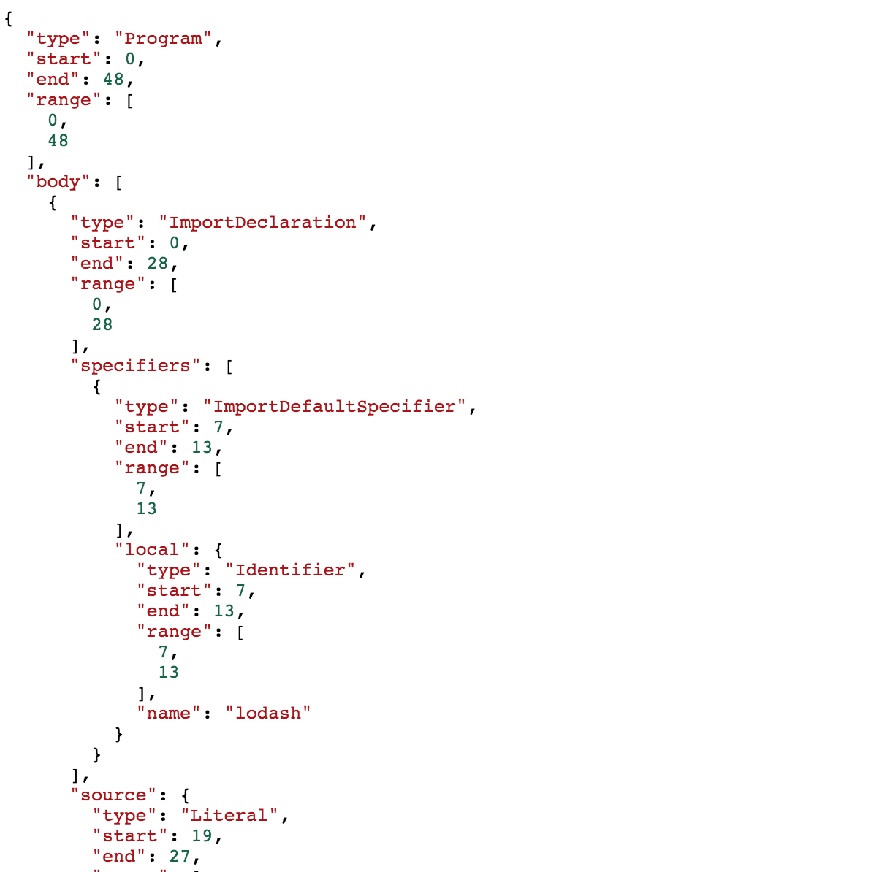
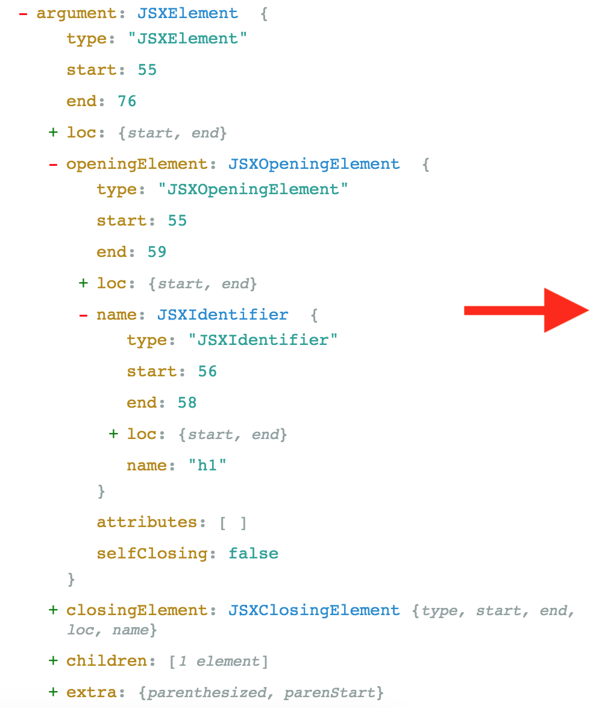
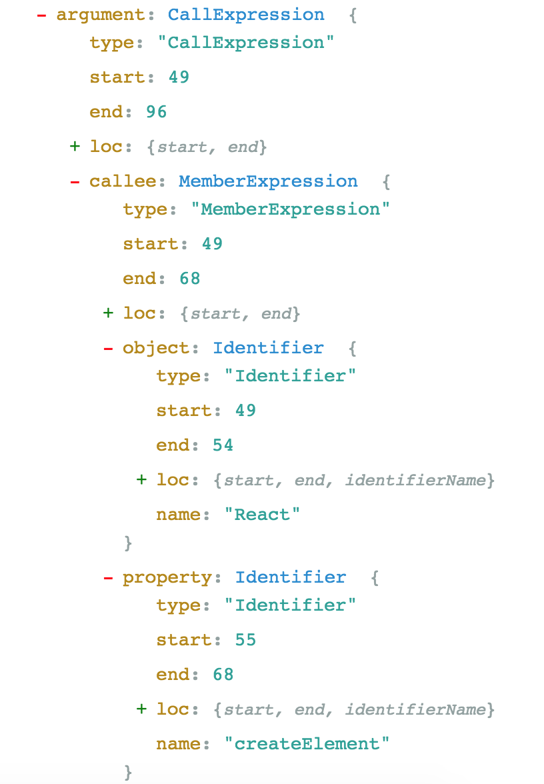

[.header-strong: #1A99FC]

# [fit] **5 Minute**
# [fit] Introduction
# [fit] to **ASTs**
# [fit] in JavaScript

---

[.header: alignment(center), text-scale(2.0)]
[.header-strong: #1A99FC]

<br>

# Hello 👋

### **I'm Saugat Acharya**

<br>

#### Open Source Enthusiast **(@mesaugat)**
#### Lead Engineer, Leapfrog Technology

---

[.header: alignment(center), text-scale(3.5)]
[.header-strong: #1A99FC]

<br>
<br>

# **ASTs**

#### What are Abstract Syntax Trees?

---

> "Tree representation of the abstract syntactic structure of source code."
<br>
-- Wikipedia

---

[.header-strong: #1A99FC]
[.header: alignment(center), text-scale(1.8)]

# Example

<br>
<br>

## **1 + (2 * 3)**


---

[.header: alignment(center), text-scale(1.8)]

# A **"Real"** Example

<br>
<br>

```javascript
function sum(a, b) {
    return a + b;
}

sum(5, 10)
```


---

# AST **Parsers**

[.header: alignment(center), text-scale(1.5)]
[.header-strong: #1A99FC]


### **https://alligator.io/js/traversing-ast**

---

<br>
<br>
<br>

# AST **Object Representation**

[.header: alignment(center), text-scale(1.8)]


---

<br>
<br>
<br>

# AST **JSON Representation**

[.header: alignment(center), text-scale(1.8)]
[.code: Dank Mono]



---

[.header: alignment(center), text-scale(1.5)]

# Who uses ASTs?

 
 

---

[.header: alignment(center), text-scale(1.5)]

# Transpilation / Transformation


#### Transforming **JSX and React** to **ES5** using Babel

---

# ES6 to ES5

[.header: alignment(center), text-scale(1.5)]



#### Converting **one AST** to **another AST**

---

[.header: alignment(center), text-scale(1.5)]

# Linting / Static Code Analysis


#### Applying **lint rules** using **ESLint**

---

# Formatting

[.header: alignment(center), text-scale(1.5)]


#### **Format code** using Prettier
#### Works by compiling code to an AST, and then pretty-printing the AST

---

[.header: alignment(center), text-scale(1.5)]

# **What Can You Do** with ASTs?

| Examples                                             |
| ---------------------------------------------------- |
| 1. Create your own Babel plugin                      |
| 2. Write custom ESLint rules                         |
| 3. Generate codemods to refactor code quickly        |
| 4. Analyze your code by looking into AST parse times |
| 5. Build your own AST parser                         |

---

[.header: alignment(center), text-scale(1.5)]
[.header-strong: #1A99FC]

# Start Exploring ASTs


#### **https://astexplorer.net**

---

[.header: alignment(center), text-scale(1.5)]
[.header-strong: #1A99FC]

# Explore AST Parsers


#### **https://astexplorer.net**

---

> Thank You 🙏
