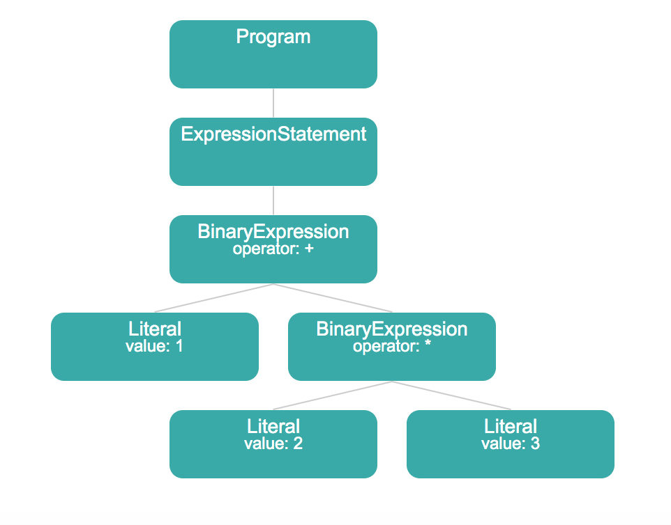
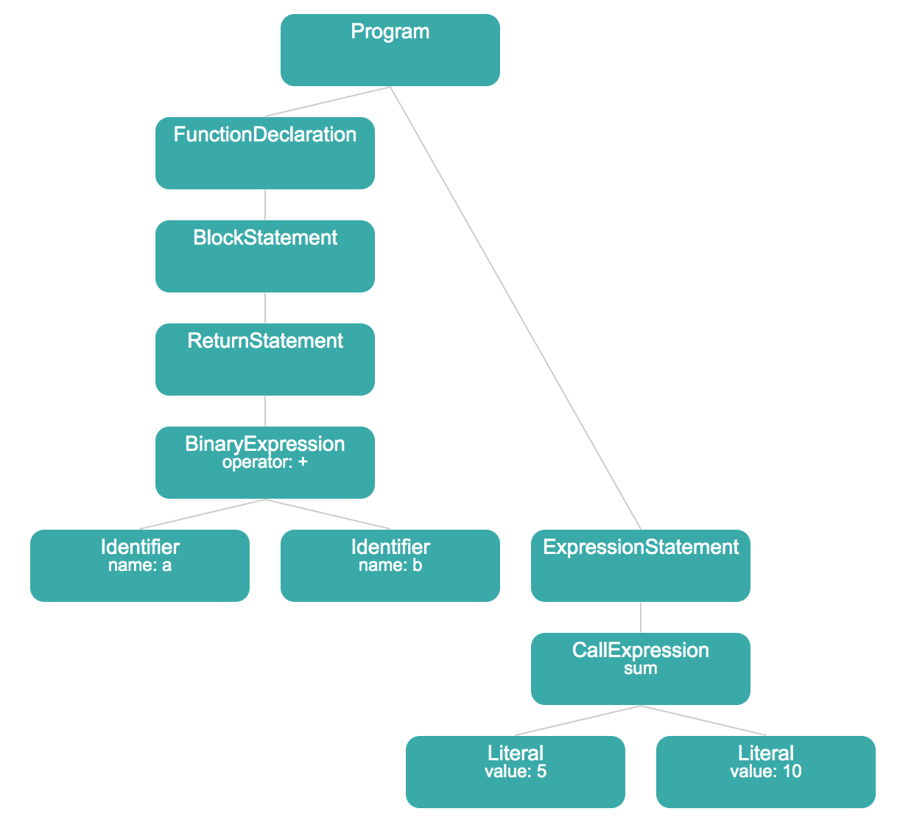
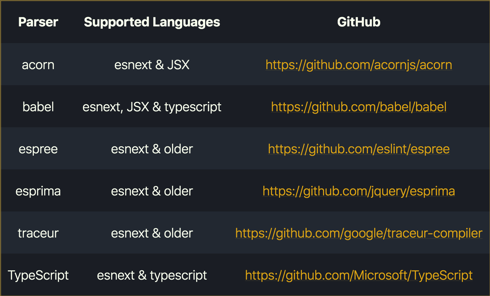
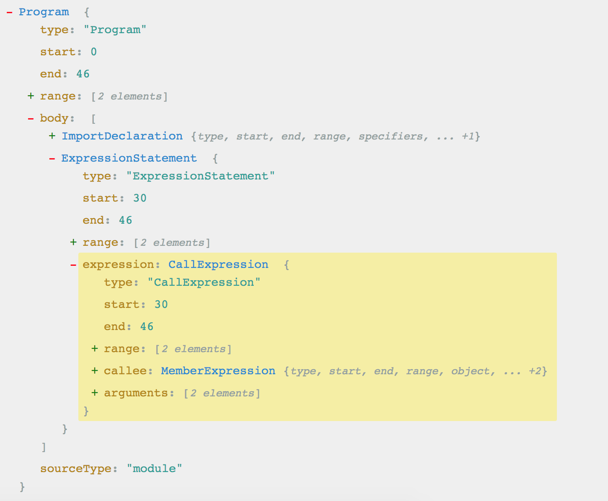
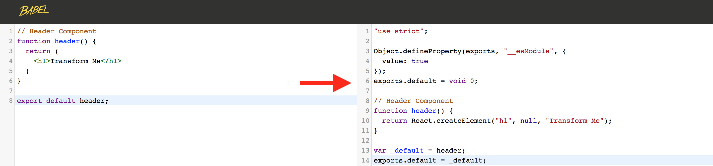
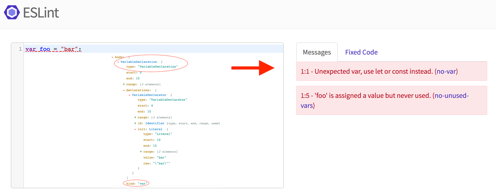
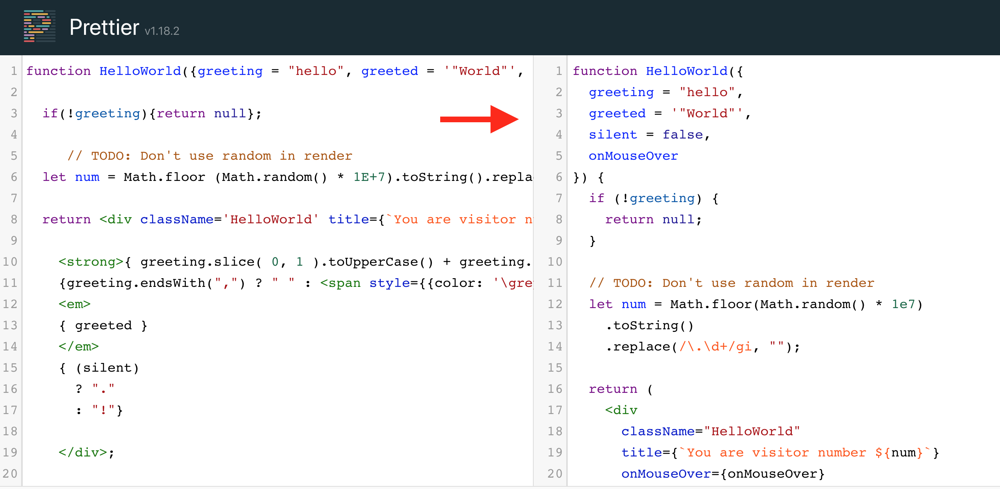
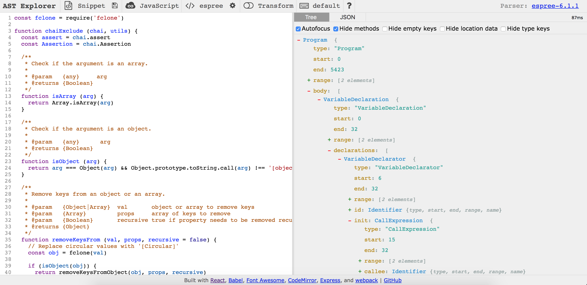
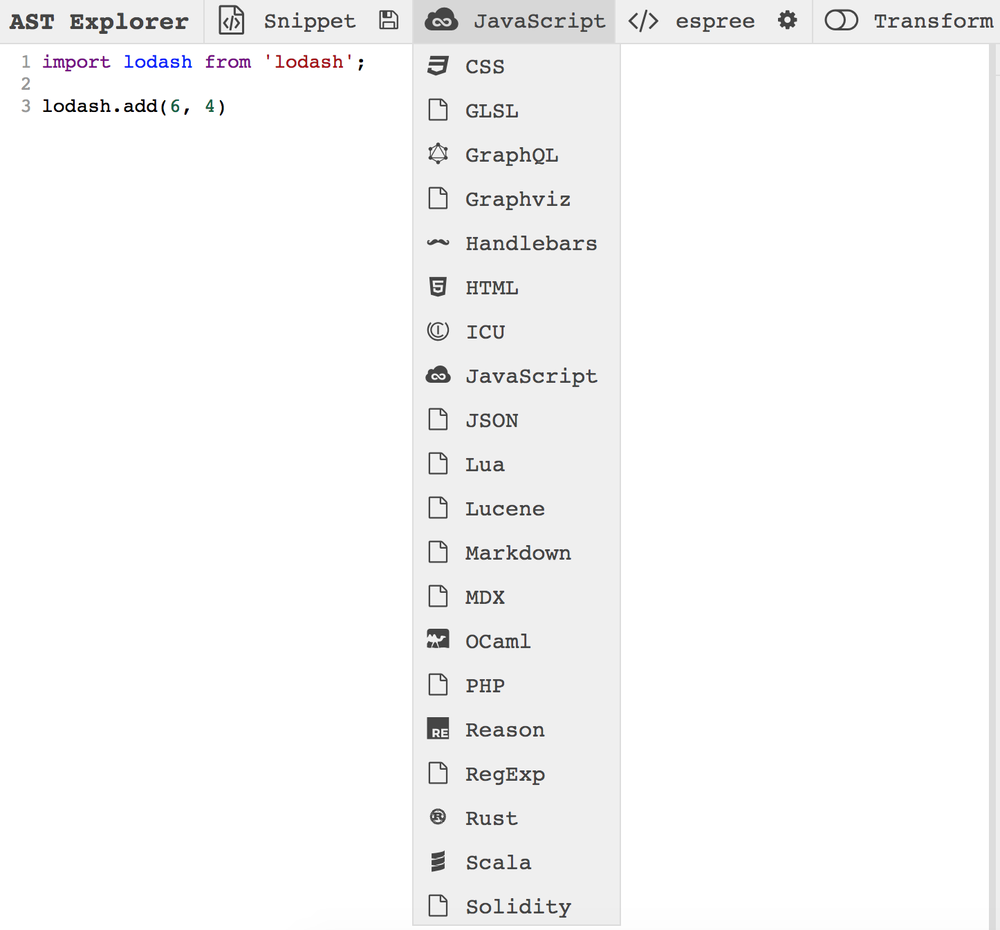

[.header-strong: #1A99FC]

# [fit] **5 Minute**
# [fit] Introduction
# [fit] to **ASTs**
# [fit] in JavaScript

---

[.header: alignment(center), text-scale(2.0)]
[.header-strong: #1A99FC]

<br>

# Hello 👋

### **I'm Saugat Acharya**

<br>

#### Open Source Enthusiast
#### Lead Engineer, Leapfrog Technology

---

[.header: alignment(center), text-scale(3.5)]
[.header-strong: #1A99FC]

<br>
<br>

# **ASTs**

#### What are Abstract Syntax Trees?

---

> "Tree representation of the abstract syntactic structure of source code."
<br>
-- Wikipedia

---

[.header-strong: #1A99FC]
[.header: alignment(center), text-scale(1.8)]

# Example

<br>
<br>

## **1 + (2 * 3)**



---

[.header: alignment(center), text-scale(1.8)]

# A **"Real"** Example

<br>
<br>

```javascript
function sum(a, b) {
    return a + b;
}

sum(5, 10)
```



---

[.header: alignment(center), text-scale(1.5)]
[.header-strong: #1A99FC]

# AST **Node** Types

- Identifier
- Literal
- Program
- Function
- ExpressionStatement
- ...

---

# AST **Parsers**

[.header: alignment(center), text-scale(1.5)]
[.header-strong: #1A99FC]



### **https://alligator.io/js/traversing-ast**

---

# AST **JSON Representation**

[.header: alignment(center), text-scale(1.5)]



---

# True **JSON Representation**

[.header: alignment(center), text-scale(1.5)]
[.code: Dank Mono]

```json
                                                                          {
                                                                            "type": "Program",
                                                                            "start": 0,
                                                                            "end": 46,
                                                                            "range": [
                                                                              0,
                                                                              46
                                                                            ],
                                                                            "body": [
                                                                              {
                                                                                "type": "ImportDeclaration",
                                                                                "start": 0,
                                                                                "end": 28,
                                                                                "range": [
                                                                                  0,
                                                                                  28
                                                                                ],
                                                                                "specifiers": [
                                                                                  {
                                                                                    "type": "ImportDefaultSpecifier",
                                                                                    "start": 7,
                                                                                    "end": 13,
                                                                                    "range": [
                                                                                      7,
                                                                                      13
                                                                                    ],
                                                                                    "local": {
                                                                                      "type": "Identifier",
                                                                                      "start": 7,
                                                                                      "end": 13,
                                                                                      "range": [
                                                                                        7,
                                                                                        13
                                                                                      ],
                                                                                      "name": "lodash"
                                                                                      ...
                                                                          }
```

---

[.header: alignment(center), text-scale(1.5)]

# Who uses ASTs?

 
 

---

[.header: alignment(center), text-scale(1.5)]

# Transpilation / Transformation



## Transforming **JSX and React** to **ES5** using Babel

---

[.header: alignment(center), text-scale(1.5)]

# Linting / Static Code Analysis



## Applying **Linter rules** using ESLint

---

# Formatting

[.header: alignment(center), text-scale(1.5)]



## **Format code** using Prettier

---

[.header: alignment(center), text-scale(1.5)]

# **What Can You Do** with ASTs?

| Examples |
|---|
| 1. Create your own Babel plugin  |
| 2. Write custom ESLint rules |
| 3. Generate codemods to refactor code quickly |
| 4. Compile one AST to another AST |
| 5. Analyze your code by looking into AST parse times |
| 6. Build your own AST parser |

---

[.header: alignment(center), text-scale(1.5)]
[.header-strong: #1A99FC]

# Start Exploring ASTs



### **https://astexplorer.net**

---

[.header: alignment(center), text-scale(1.5)]
[.header-strong: #1A99FC]

# Explore ASTs for Other Languages



### **https://astexplorer.net**

---

> Thank You 🙏
