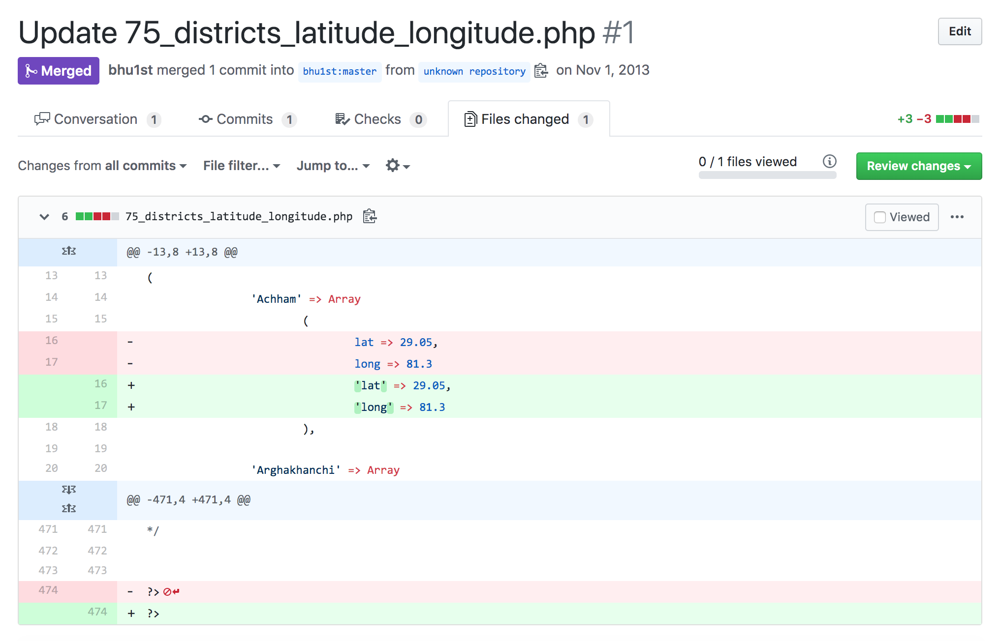
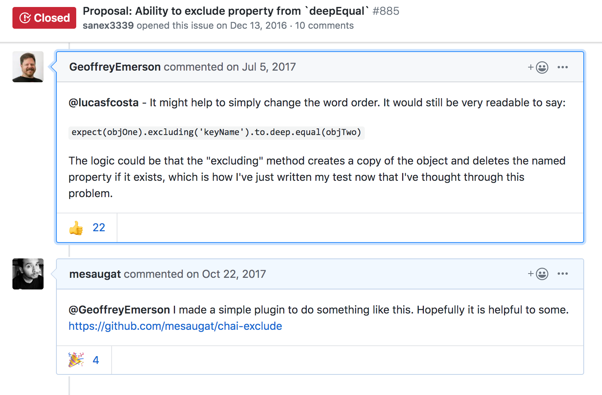
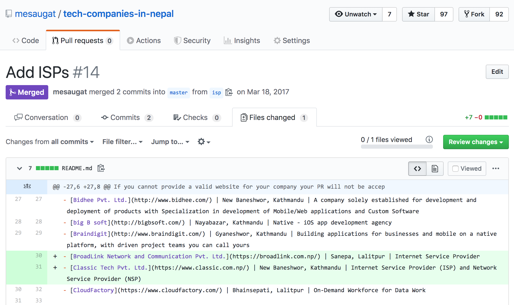
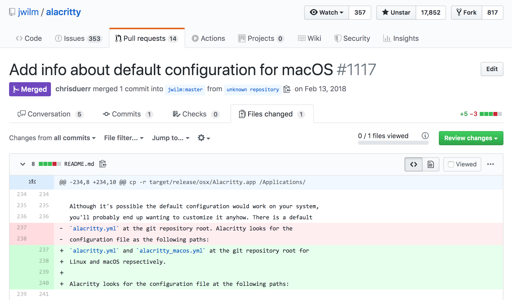
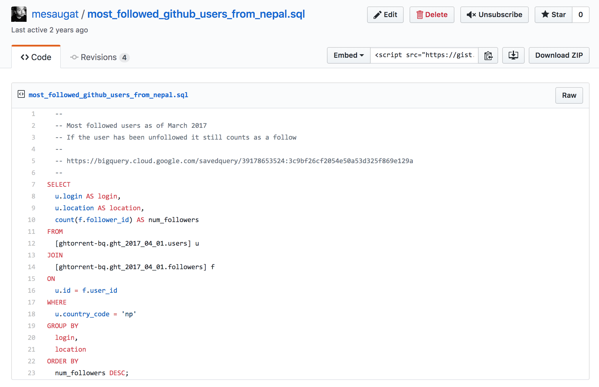
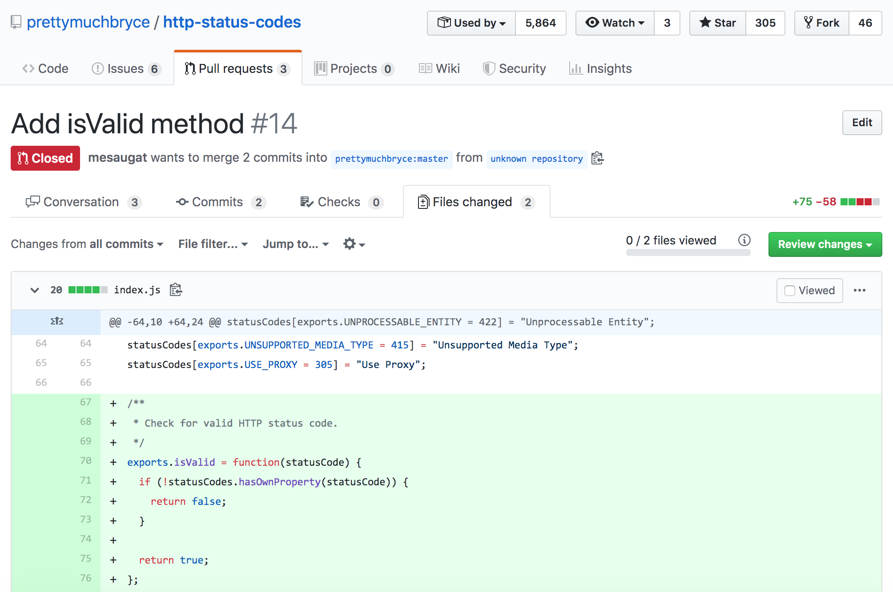
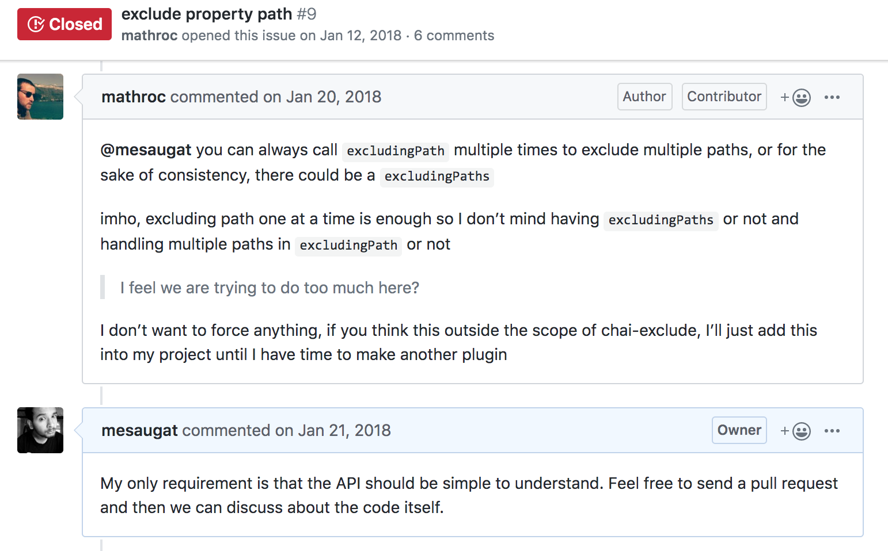

# Embracing Open Source


---

### "Open Source" refers to code people can modify and share because it is publicly accessible.

---

## What is Open Source Today?

<br>

* Open Exchange
* Transparency
* Community-oriented Development
* Collaboration

---

## And Most Importantly

### It's About [Solving Problems](https://media.giphy.com/media/5z0cCCGooBQUtejM4v/giphy.gif)

---

## 1. Start By Creating Something Small

---

## geoJSON-Nepal


---

## ¯\\_(ツ)_/¯

```javascript
{
  "type": "FeatureCollection",
  "features": [
  {
    "type": "Feature",
    "id": 0,
    "properties": {
      "REGION": "Mid-Western"
    },
    "geometry": {
      "type": "Polygon",
      "coordinates": [
        [
          [ 81.272811889648437, 30.047199249267578 ],
          [ 81.273910522460938, 30.049659729003906 ],
          [ 81.274269104003906, 30.051664352416992 ]
        ]
      ]
    }
  }
}
```

---

## 2. Contribute to What You Are Familiar With

---



---



---

## 3. Contribution Doesn't Have To Be Code

---



---


---


---


---



---



---

## 4. Not Everything Will Fall In Place

---



---


---



---

## 5. Embrace the Community

---


---

## 6. Everyone Has to Start Somewhere


---

## 7. But I Can't Do It ...


---

## You Wish.


---

## Go Go Go


---

## Readings / References

* [How to contribute to Open Source](https://opensource.guide/how-to-contribute/)
* [Max Stoiber - I want you to contribute to open source](https://www.youtube.com/watch?v=hwdeUG_gySI)
* [Kent C. Dodds - Contributing to Open Source for Beginners](https://www.youtube.com/watch?v=k6KcaMffxac)
* [Faith and Open Source](https://hopeinsource.com/faith/)
* [A Bitter Guide to Open Source](https://medium.com/codezillas/a-bitter-guide-to-open-source-a8e3b6a3c1c4)
* [GitHub Stars Won't Pay Your Rent](https://medium.com/@kitze/github-stars-wont-pay-your-rent-8b348e12baed)
* [Learning From Code Reviews](https://soundcloud.com/do-not-merge/learning-from-code-reviews)

---

## Thank You


<!--

## Presentation Links

1. https://github.com/mesaugat/geoJSON-Nepal
2. https://github.com/bhu1st/nepal_in_php_arrays/pull/1/files
3. https://github.com/chaijs/chai/issues/885#issuecomment-313163538
4. https://github.com/mesaugat/chai-exclude
5. https://github.com/mesaugat/tech-companies-in-nepal/pull/14
6. https://github.com/kubernetes/kubernetes/pull/72636
7. https://github.com/srishanbhattarai/nepcal/issues/23
8. https://github.com/mesaugat/express-api-es6-starter/issues?q=is%3Aissue+is%3Aclosed+label%3Aquestion
9. https://github.com/jwilm/alacritty/pull/1117/files
10. https://gist.github.com/mesaugat/6c044f665a77e5756f9b9c6d1fb90889
11. https://github.com/prettymuchbryce/http-status-codes/pull/14/files
12. https://github.com/hashicorp/docker-vault/pull/123/files
13. https://github.com/mesaugat/chai-exclude/issues/9
14. https://github.com/microsoft/tslint-microsoft-contrib/pull/623

-->
