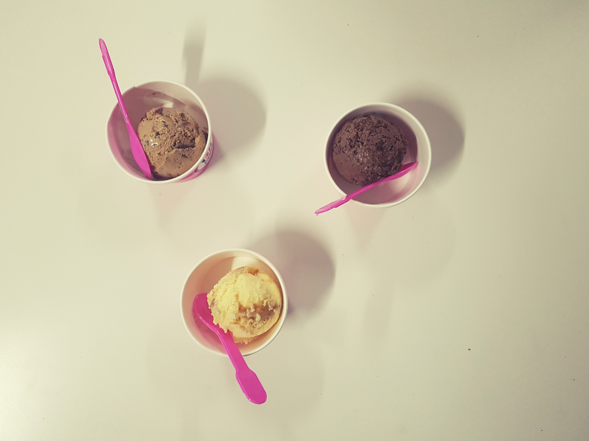
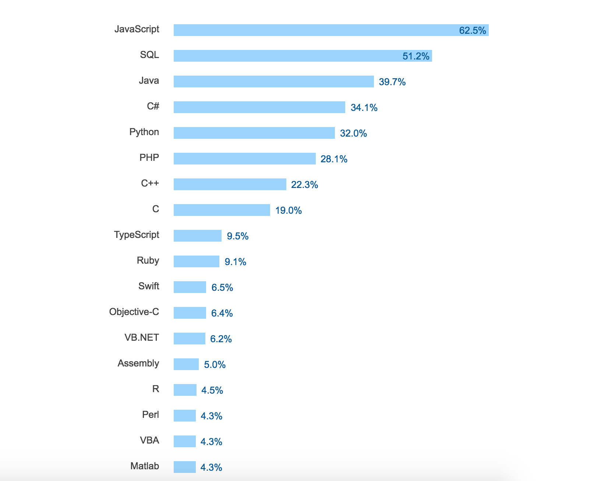
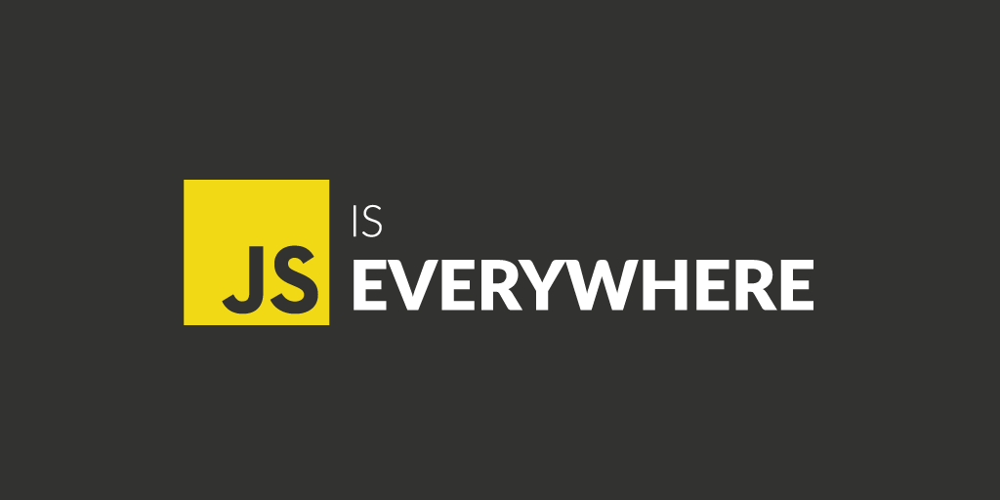
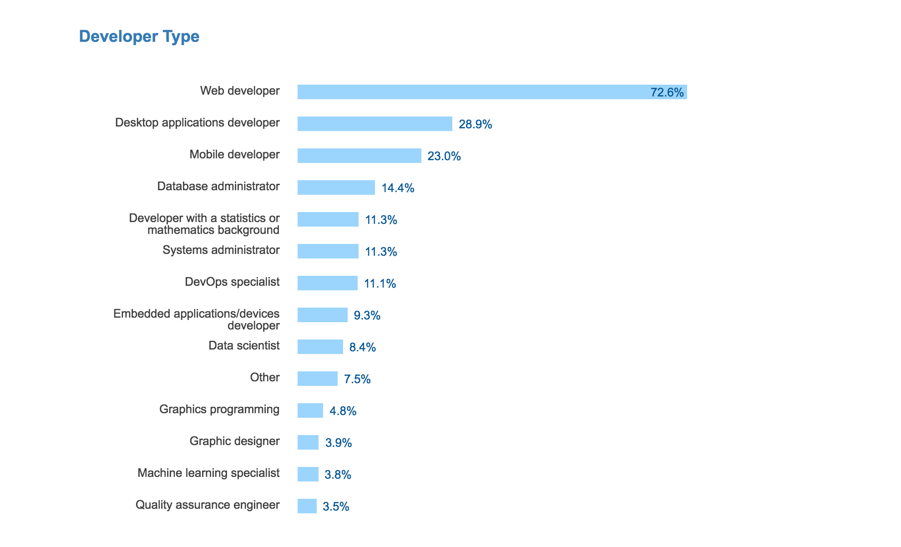
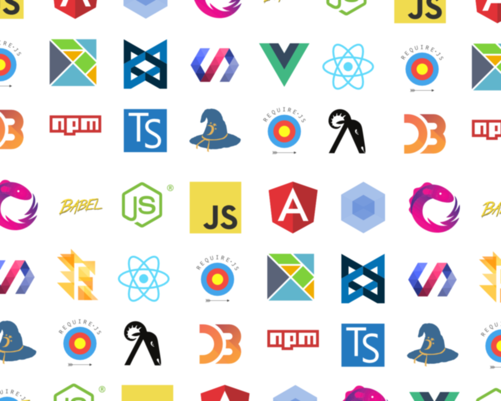
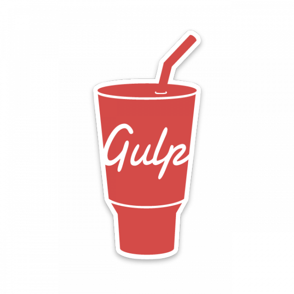
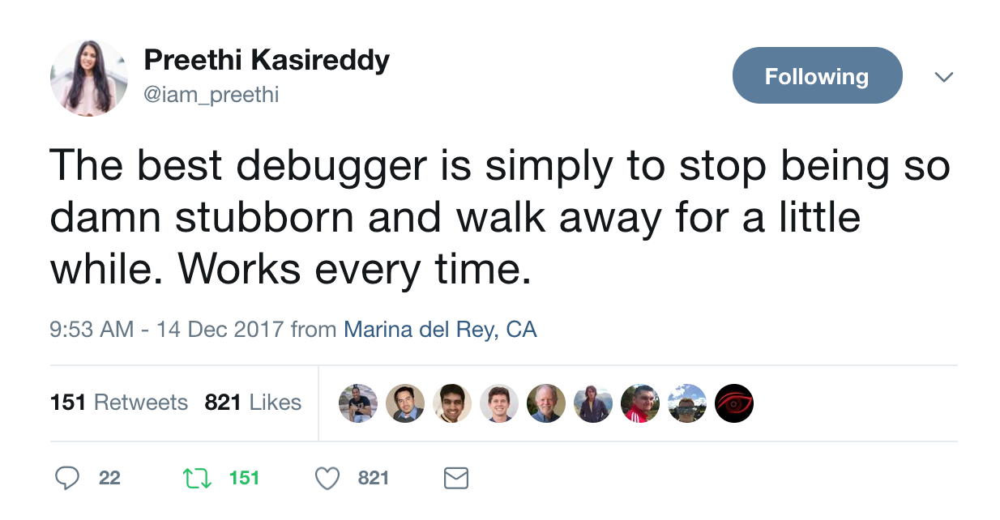

## Why to **JavaScript** in 2018?

---


## Saugat Acharya


<br>

* Senior Software Engineer
* Open Source Enthusiast

<br>

[https://github.com/mesaugat](https://github.com/mesaugat)

---

[.build-lists: true]



# What is this talk about?

<br>

* **Why to Frontend?**

<br>

* **What the Frontend?**

<br>

* **How to Frontend?**

---


## 1. Why?

---



# **Most Popular Technology**

## Since 2014

---



---



---


## Of which only **12%** are **Frontend Developers**

---


## 2. What?

---


---


# 

### Practice of ~~writing~~ **producing** HTML, CSS and JavaScript for a website.

---


---


## 3. How?

---


# Start Small

```html
  <!-- HTML -->
  <!DOCTYPE html>
```

<br>

```css
  /* CSS */
  body {
    background-color: lightblue;
  }
```

<br>

```javascript
  // JavaScript
  console.log('Hello, World!');
```

---


# Learn the Fundamentals

- ES6
- Closures
- Functions
- Callbacks
- Promises
- Modules
- and more ...

---



# Choose a Framework

---

# Tooling

 
 


---


# Head Start

<br>

* create-react-app

<br>

* angular-cli

<br>

* vue-cli

<br>

---


# Concepts

* Virtual DOM
* JSX
* State

<br>

* Template
* Data Binding
* Code Splitting

<br>

* ...

---
# It's Not Easy !



## **Be patient ...**

---


# Don't Get On The Hype Train

---


#  Thank You

---


### **“Any application that can be written in JavaScript, will eventually be written in JavaScript.” **

### —  Jeff Atwood
